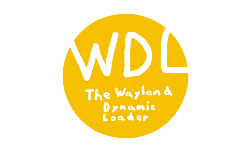

# WDL - The Wayland Dynamic Loader



WDL is a lightweight single-header library that loads `libwayland-client.so` (currently wayland 1.24) at runtime to allow things such as Wayland/X11 support in 1 binary <br>
It is designed to be a drop-in replacement but it might not fully work and you may need to adjust things, if you do please tell us so we can improve on it

<br>

## Examples
Currently there are no provided examples but some will come soon

## Tests
Tests can be found in the `tests/` directory, to run them simply run
```bash
make <test>
```
It should give you an output like this
```
[Test #0] Tested wl_display_interface.name, expected: wl_display, actual: wl_display, passed: yes
[Test #1] Tested wl_registry_interface.name, expected: wl_registry, actual: wl_registry, passed: yes
[Test #2] Tested wl_callback_interface.name, expected: wl_callback, actual: wl_callback, passed: yes
[Test #3] Tested wl_compositor_interface.name, expected: wl_compositor, actual: wl_compositor, passed: yes
[Test #4] Tested wl_shm_pool_interface.name, expected: wl_shm_pool, actual: wl_shm_pool, passed: yes
[Test #5] Tested wl_shm_interface.name, expected: wl_shm, actual: wl_shm, passed: yes
```
If any tests fail please open a bug report with your platform/wayland version so we can try to fix it

# License
Copyright 2025 Hannah S. <br>
You can copy, modify and share this software under the following conditions:

1. Any modifications to this software must be published under the same license and must be properly marked as modified versions

2. You are not allowed to use the name of this software or its developers/contributors to endorse a derived product without explicit permission by the copyright holder

3. You must include this copyright notice alongside binary distributions of this software

This software is provided as-is, i (the copyright holder) am not responsible for any damage caused by it